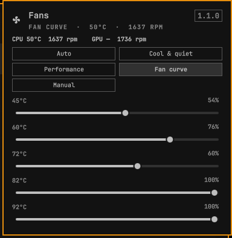

# Fans

Bar widget for the fans on a Sager / Clevo P870DM-G.

Click the fan icon. Auto leaves the laptop in charge. Cool & quiet and Performance pick a fan curve and the matching firmware power profile. Fan curve is your own speeds. Manual holds one speed.

Right-click the icon to return to Auto. Scroll it, while Manual is selected, to nudge the speed. At 95°C the fans go to full speed no matter what the curve says.



## Install

```sh
omarchy plugin add https://github.com/wouldja/omarchy-fans.git --enable
```

This panel uses the `sager_kbd` kernel module shipped with the Keyboard plugin. Install that plugin and its driver first:

```sh
omarchy plugin add https://github.com/wouldja/omarchy-keyboard.git --enable
pkexec ~/.config/omarchy/plugins/io.github.wouldja.keyboard/driver/install.sh
```

The widget lands on the right of the bar. If it does not appear immediately:

```sh
omarchy-shell shell rescanPlugins
```

The chosen mode is stored in `~/.config/sager-fans/state.json`. A small kernel thread keeps a curve running after the panel closes, and puts the fans back on the laptop's own control if the driver is removed.

## Remove

```sh
omarchy plugin remove io.github.wouldja.fans
```

That drops the widget and leaves `~/.config/sager-fans/` in place. It does not remove `sager_kbd`. That module is shared with the Keyboard plugin.

## License and dependencies

MIT. See [LICENSE](LICENSE).

Needs Omarchy (Quickshell), Python 3, and the `sager_kbd` module from [omarchy-keyboard](https://github.com/wouldja/omarchy-keyboard). No network calls.
